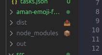

# Emoji Folder Icons for VS Code

Make your VS Code Explorer more visually engaging with automatically assigned emoji icons for your folders.

## Features

- Automatically detects common folder names and assigns relevant emoji icons
- Lightweight and non-intrusive UI integration with VS Code's File Explorer
- Customizable emoji mappings through settings
- Improves visual organization of your project structure

![Screenshot of Emoji Folder Icons in action]


## Default Emoji Mappings

Here are some examples of the default folder-to-emoji mappings:

| Folder Name | Emoji |
|-------------|-------|
| src, source | 📦 |
| assets | 🎨 |
| images, img | 🖼️ |
| docs, documentation | 📜 |
| test, tests | 🧪 |
| config | ⚙️ |
| dist | 📤 |
| build | 🔨 |
| lib, libs | 📚 |
| components | 🧩 |
| utils | 🛠️ |
| public | 🌐 |
| data | 📊 |
| api | 🔌 |

... and many more!

## Extension Settings

This extension contributes the following settings:

* `emojiFolderIcons.enabled`: Enable/disable the extension
* `emojiFolderIcons.customMappings`: Custom folder name to emoji mappings

Example settings.json:

```json
{
  "emojiFolderIcons.enabled": true,
  "emojiFolderIcons.customMappings": {
    "myFolder": "🚀",
    "backend": "🖥️"
  }
}
```

## Commands

* `Emoji Folder Icons: Refresh` - Manually refresh the emoji icons

## Requirements

VS Code version 1.60.0 or higher.

## Extension Development

* Clone this repository
* Run `npm install`
* Press F5 to open a new window with your extension loaded
* Observe the emoji icons in the Explorer view
* Make changes to the code, restart the extension by reloading the window

## Known Issues

Please report any issues on the GitHub repository.

## Release Notes

### 0.1.0

Initial release of Emoji Folder Icons with basic functionality.

## Contributing

Contributions are welcome! Please feel free to submit a Pull Request.

## License

This extension is licensed under the MIT License.